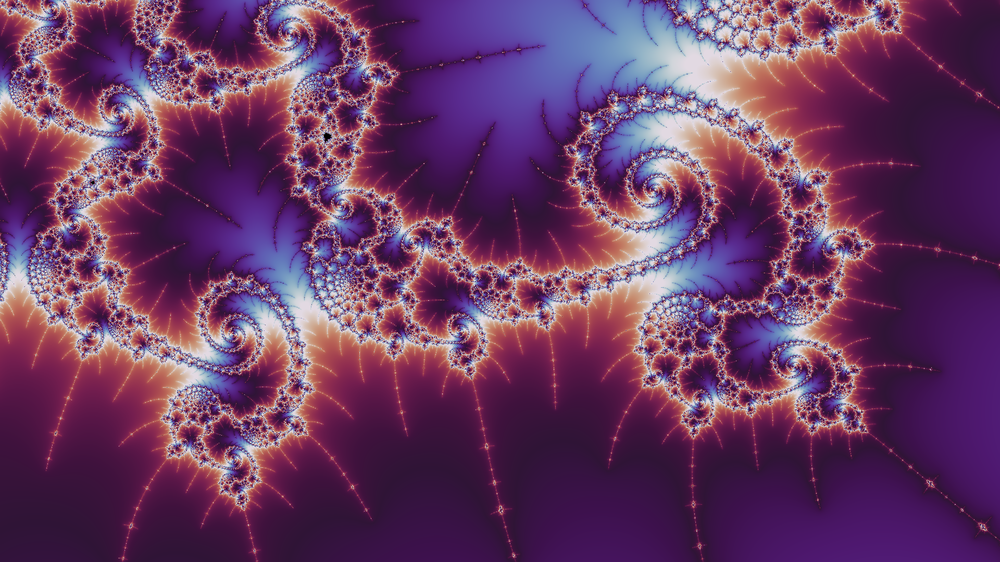
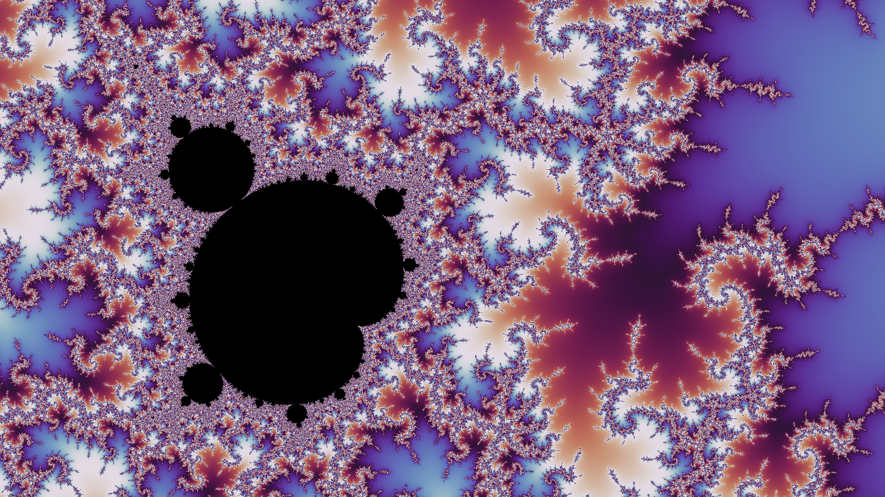

<h1>Realtime Fractal Exploration</h1>

A basic program to explore various fractals, focusing on creating pretty results. Including:

<ul>
  <li>The base Mandelbrot (double precision)</li>
  <li>Some variations (more interesting complex equations, but only float precision)</li>
  <li>A double pendulum fractal</li>
</ul>

<h2>Controls</h2>
<ul>
  <li>WASD movement</li>
  <li>(Shift) Space for zooming in and out</li>
  <li>Q,E to decrease/increase iterations</li>
  <li>Shift + Q,E to change bailout radius</li>
  <li>Ctrl + Q,E to change colour scale</li>
  <li>Shift + Ctrl + Q,E to offset colour palette</li>
  <li>O to switch fractals</li>
  <li>U,I to cycle variations</li>
  <li>Manual control over colour palettes (#DEFINE xxxx_PALETTE in .frag files)</li>
</ul>

<h2>Showcase</h2>
</img>
</img>
